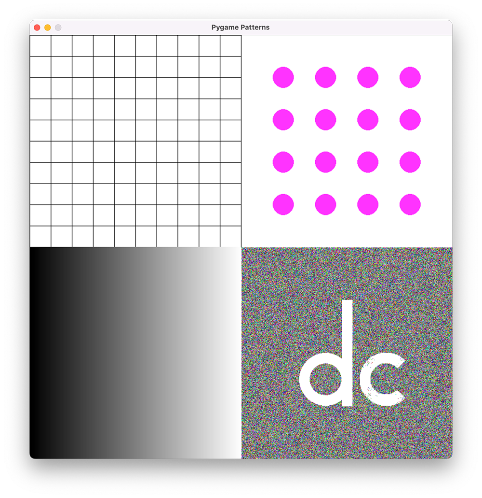

# Pygame Patterns
Apply your knowledge of `for` and `while` loops to draw patterns and sequences of objects. Create a single Python program, `patterns.py`, using the Pygame library to draw this window:

The window is 800x800 pixels and features four quadrants of graphics:

- Quadrant 1 is a 10 x 10 grid of lines.
- Quadrant 2 is grid 4 x 4 evenly-spaced circles.
- Quadrant 3 is a horizontal greyscale gradient from black to white.
- Quadrant 4 is filled with randomly-coloured individual pixels, featuring your initial or initials on top.

In your program, you will need to implement the following:

- Use the [`pygame.draw()`](https://www.pygame.org/docs/ref/draw.html) function to create lines, arcs, and shapes.
- Use the [`pygame.color()`](https://www.pygame.org/docs/ref/color.html) function to define colours.
- Define custom colours using RGB or (red, green, blue) values, where `BLACK = (0, 0, 0)` and `WHITE = (255, 255, 255)`.
- Use the `random` module to generate random numbers. Fpr example, calling `random.randint(0, 10)` generates a random integer in the range of 0 to 10.
- If you are drawing arcs, you will need to specify your angles using radians, not degrees. Use a resource like [this](https://www.mathsisfun.com/geometry/radians.html) to get equivalent radian values for the degree angles you want when working with arcs.

## Submission
Push your code to your repository with a meaningful commit message indicating completion. In addition, take a screenshot of your finished window and upload it to Google Classroom.